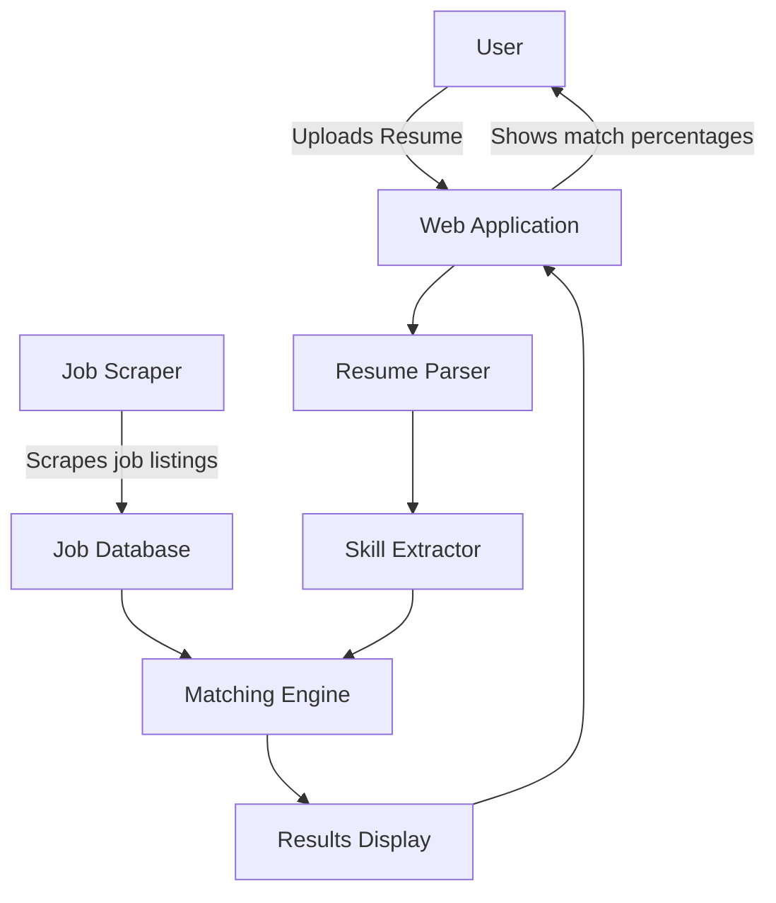

# Resume Matcher App

This application matches resumes with job listings.

## Application Architecture



## Project Structure

```
resume_matcher/
│
├── .dockerignore
├── Dockerfile
├── Makefile
├── docker-compose.yml
├── environment.yml
├── requirements.txt
├── app/
│   ├── __init__.py
│   ├── main.py
│   ├── resume_parser.py
│   ├── job_scraper.py
│   └── matching_engine.py
├── tests/
│   └── test_main.py
└── README.md
```
