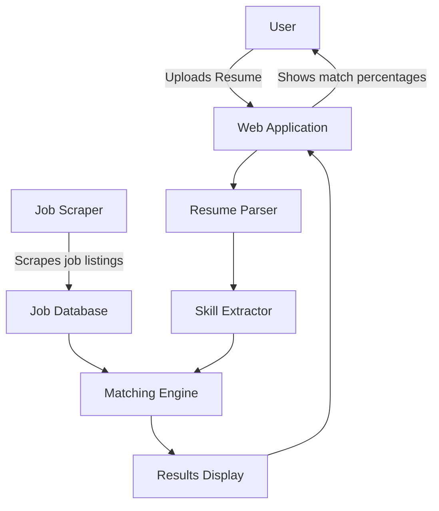

# Resume Matcher App


## Project Overview
Resume Matcher is an application that automates the process of matching resumes to job listings. It uses natural language processing and machine learning techniques to analyze resumes and job descriptions, providing a scoring system to rank how well a resume matches a given job.

## Current Features
1. Resume Parsing: Extracts key information from PDF and DOCX resumes.
2. Job Scraping: Scrapes job listings from Indeed (for demonstration purposes).
3. Matching Engine: Compares parsed resumes against job listings using keyword matching, semantic similarity, and experience scoring.

## Application Architecture



## Project Structure

```
resume_matcher/
├── app/
│   ├── init.py
│   ├── main.py
│   ├── resume_parser.py
│   ├── job_scraper.py
│   └── matching_engine.py
├── tests/
│   ├── init.py
│   ├── test_resume_parser.py
│   ├── test_job_scraper.py
│   └── test_matching_engine.py
├── uploads/
├── requirements.txt
├── Makefile
├── environment.yml
└── README.md
```

## How it works

## Development Steps
1. Set up project structure and environment
2. Implement resume parsing functionality
3. Develop job scraping component
4. Create matching algorithm
5. Implement testing for each component
6. Integrate components in the main application

## Current Bottlenecks and Challenges
1. Resume Parsing Accuracy: Improving the accuracy of information extraction from various resume formats.
2. Job Scraping Limitations: Ensuring compliance with job sites' terms of service and handling changes in their HTML structure.
3. Matching Algorithm Refinement: Enhancing the matching algorithm to better understand context and relevance.
4. Scalability: Optimizing the application to handle a large number of resumes and job listings efficiently.

## End Goals
1. User Interface: Develop a user-friendly web interface for resume upload and job matching.
2. Advanced NLP: Implement more sophisticated NLP techniques for better understanding of resume and job content.
3. Customizable Matching: Allow users to adjust matching criteria and weights.
4. Job Recommendation System: Provide personalized job recommendations based on user profiles and preferences.
5. Integration with Job Platforms: Establish partnerships or APIs with major job listing platforms for real-time job data.
6. Privacy and Security: Implement robust data protection measures to ensure user information security.
7. Analytics Dashboard: Provide users with insights into their job search process and match statistics.
8. Mobile Application: Develop a mobile version of the application for on-the-go access.

## Contributing
Contributions to the Resume Matcher project are welcome! Please refer to our contributing guidelines for more information.

